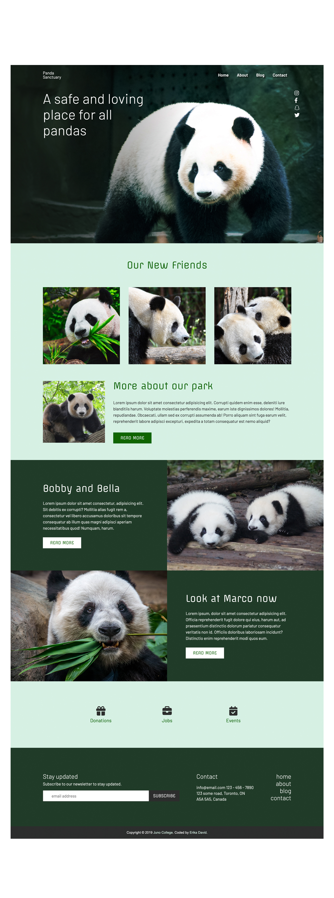

# Juno College Cohort 49 - Assignment 1

## Objective:

The objective of this assignment is to convert an assigned PSD* into a well-tested, accessible, responsive and pixel-perfect landing page for desktop and mobile. This assignment assess HTML and SCSS skills along with responsive design abilities. 

*The design, style guide and assets are provided by Juno College, formely known as Hacker You. 

## The result:

The converted PSD is responsive all the way down to 420px. Multiple breakpoints are used to ensure compatibility with other devices. Shown below are the desktop and mobile (480px) views of the completed assignment. 

# Desktop:

# Mobile (480px):

